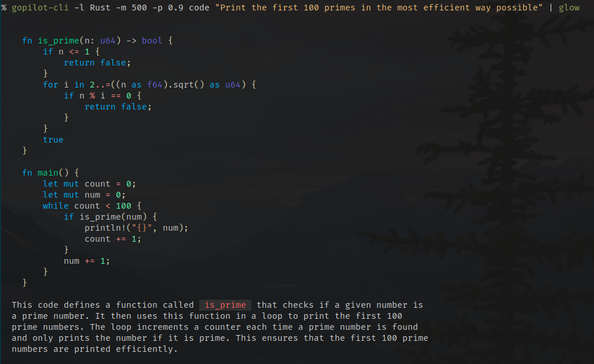
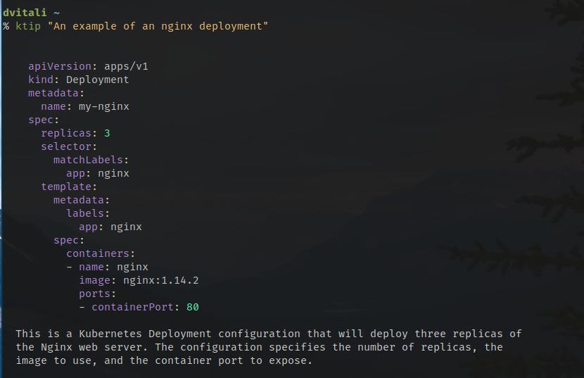
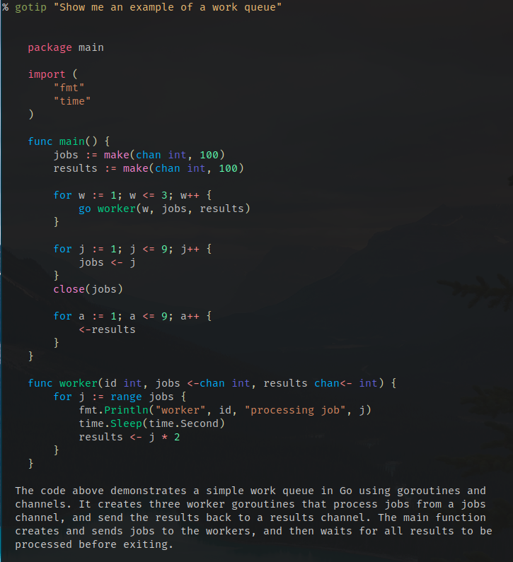

# gopilot-cli

A GitHub Copilot CLI, written in Go.

Inspired by [B00TK1D/copilot-api](https://github.com/B00TK1D/copilot-api).



## Disclaimer

> [!IMPORTANT]
> This tool is not affiliated with GitHub, Microsoft or OpenAI.
> It might violate the GitHub Copilot terms of service - use at your own risk.
>
> This tool requires an active [GitHub Copilot](https://github.com/features/copilot) subscription
> (10$/month for individuals).


## Example

### `query`

```bash
gopilot-cli query "How do I get the number of CPUs?"
```

```plain
nproc
```

### `code`

```bash
gopilot-cli -l Rust -m 500 -p 0.9 code "Print the first 100 primes in the most efficient way possible"
```

> ```rust
> fn is_prime(n: u64) -> bool {
>     if n == 2 {
>         return true;
>     }
>
>     if n < 2 || n % 2 == 0 {
>         return false;
>     }
>
>     let mut i = 3;
>     while i * i <= n {
>         if n % i == 0 {
>             return false;
>         }
>         i += 2;
>     }
>
>     return true;
> }
>
> fn main() {
>     let mut count = 0;
>     let mut i = 0;
>     while count < 100 {
>         if is_prime(i) {
>             println!("{}", i);
>             count += 1;
>         }
>         i += 1;
>     }
> }
> ```
>
> This code defines a function to check if a number is prime and prints the first 100 prime numbers.
> The `is_prime` function checks if a number is prime by dividing it by all odd numbers up to the square root of the number.
> The `main` function iterates through numbers, checks if they are prime using `is_prime`, and prints them until 100 primes are found.

## Installation

```
go install github.com/denysvitali/gopilot-cli@latest
```

## Usage

Check `gopilot-cli -h` for more information or refer to the examples above.

> [!TIP]
> You can pipe the output of the `gopilot-cli code` subcommand to [`glow`](https://github.com/charmbracelet/glow)
> to render the markdown code blocks in your terminal.


## Suggested shell integrations

### `ktip`

Provides answers to your Kubernetes questions.



Add this to your `.zshrc` (or `.bashrc`):
```zsh
function ktip(){
	gopilot-cli -l Kubernetes -m 500 -p 0.9 code "$1" | glow
}
```

### `gotip`

Provides answers to your Go questions.



Add this to your `.zshrc` (or `.bashrc`):
```zsh
function gotip(){
	gopilot-cli -l Go -m 500 -p 0.9 code "$1" | glow
}
```

